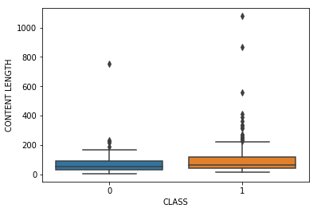

```python
import pandas as pd
import nltk
from nltk.corpus import stopwords
import seaborn as sns
import matplotlib.pyplot as plt
%matplotlib inline
import string
import numpy as np
```


```python

```


```python
Psy_df = pd.read_csv('Youtube01-Psy.csv')
```


```python
Psy_df.head()
```


<div>
<style scoped>
    .dataframe tbody tr th:only-of-type {
        vertical-align: middle;
    }

    .dataframe tbody tr th {
        vertical-align: top;
    }

    .dataframe thead th {
        text-align: right;
    }
</style>
<table border="1" class="dataframe">
  <thead>
    <tr style="text-align: right;">
      <th></th>
      <th>COMMENT_ID</th>
      <th>AUTHOR</th>
      <th>DATE</th>
      <th>CONTENT</th>
      <th>CLASS</th>
    </tr>
  </thead>
  <tbody>
    <tr>
      <th>0</th>
      <td>LZQPQhLyRh80UYxNuaDWhIGQYNQ96IuCg-AYWqNPjpU</td>
      <td>Julius NM</td>
      <td>2013-11-07T06:20:48</td>
      <td>Huh, anyway check out this you[tube] channel: ...</td>
      <td>1</td>
    </tr>
    <tr>
      <th>1</th>
      <td>LZQPQhLyRh_C2cTtd9MvFRJedxydaVW-2sNg5Diuo4A</td>
      <td>adam riyati</td>
      <td>2013-11-07T12:37:15</td>
      <td>Hey guys check out my new channel and our firs...</td>
      <td>1</td>
    </tr>
    <tr>
      <th>2</th>
      <td>LZQPQhLyRh9MSZYnf8djyk0gEF9BHDPYrrK-qCczIY8</td>
      <td>Evgeny Murashkin</td>
      <td>2013-11-08T17:34:21</td>
      <td>just for test I have to say murdev.com</td>
      <td>1</td>
    </tr>
    <tr>
      <th>3</th>
      <td>z13jhp0bxqncu512g22wvzkasxmvvzjaz04</td>
      <td>ElNino Melendez</td>
      <td>2013-11-09T08:28:43</td>
      <td>me shaking my sexy ass on my channel enjoy ^_^ </td>
      <td>1</td>
    </tr>
    <tr>
      <th>4</th>
      <td>z13fwbwp1oujthgqj04chlngpvzmtt3r3dw</td>
      <td>GsMega</td>
      <td>2013-11-10T16:05:38</td>
      <td>watch?v=vtaRGgvGtWQ   Check this out .</td>
      <td>1</td>
    </tr>
  </tbody>
</table>
</div>


```python
Psy_df.info()
```

    <class 'pandas.core.frame.DataFrame'>
    RangeIndex: 350 entries, 0 to 349
    Data columns (total 5 columns):
    COMMENT_ID    350 non-null object
    AUTHOR        350 non-null object
    DATE          350 non-null object
    CONTENT       350 non-null object
    CLASS         350 non-null int64
    dtypes: int64(1), object(4)
    memory usage: 8.2+ KB
    


```python
Psy_df['CONTENT LENGTH'] = Psy_df['CONTENT'].apply(len)
```


```python
Psy_df.groupby('CLASS').describe()
```


<div>
<style scoped>
    .dataframe tbody tr th:only-of-type {
        vertical-align: middle;
    }

    .dataframe tbody tr th {
        vertical-align: top;
    }

    .dataframe thead tr th {
        text-align: left;
    }

    .dataframe thead tr:last-of-type th {
        text-align: right;
    }
</style>
<table border="1" class="dataframe">
  <thead>
    <tr>
      <th></th>
      <th colspan="8" halign="left">CONTENT LENGTH</th>
    </tr>
    <tr>
      <th></th>
      <th>count</th>
      <th>mean</th>
      <th>std</th>
      <th>min</th>
      <th>25%</th>
      <th>50%</th>
      <th>75%</th>
      <th>max</th>
    </tr>
    <tr>
      <th>CLASS</th>
      <th></th>
      <th></th>
      <th></th>
      <th></th>
      <th></th>
      <th></th>
      <th></th>
      <th></th>
    </tr>
  </thead>
  <tbody>
    <tr>
      <th>0</th>
      <td>175.0</td>
      <td>69.085714</td>
      <td>67.765727</td>
      <td>4.0</td>
      <td>31.0</td>
      <td>54.0</td>
      <td>91.5</td>
      <td>753.0</td>
    </tr>
    <tr>
      <th>1</th>
      <td>175.0</td>
      <td>104.685714</td>
      <td>126.933998</td>
      <td>14.0</td>
      <td>41.5</td>
      <td>64.0</td>
      <td>115.5</td>
      <td>1078.0</td>
    </tr>
  </tbody>
</table>
</div>


```python
sns.boxplot(x = 'CLASS', y = 'CONTENT LENGTH', data = Psy_df)
```


    <matplotlib.axes._subplots.AxesSubplot at 0x15956690>





```python
sns.countplot(y = 'CLASS', data = Psy_df)
```


    <matplotlib.axes._subplots.AxesSubplot at 0x177ad750>


```python
sns.distplot(Psy_df['CLASS'], kde = False, bins = 50)
```


    <matplotlib.axes._subplots.AxesSubplot at 0x171fd230>


```python
def text_process(content):
    nopunc = [char for char in content if char not in string.punctuation]
    
    nopunc = ''.join(nopunc)
    
    return [word for word in nopunc.split() if word.lower() not in stopwords.words('english')]
```


```python
from sklearn.feature_extraction.text import CountVectorizer
```


```python
cv = CountVectorizer(analyzer= text_process).fit(Psy_df['CONTENT'])
```


```python
bow = cv.transform(Psy_df['CONTENT'])
```


```python
from sklearn.feature_extraction.text import TfidfTransformer
```


```python
tfidf = TfidfTransformer().fit(bow)
```


```python
tfidf.transform(bow)
```


    <350x1459 sparse matrix of type '<class 'numpy.float64'>'
    	with 2671 stored elements in Compressed Sparse Row format>


```python
from sklearn.model_selection import train_test_split
```


```python
X = Psy_df['CONTENT']
y = Psy_df.CLASS
```


```python
X.head()
```


    0    Huh, anyway check out this you[tube] channel: ...
    1    Hey guys check out my new channel and our firs...
    2               just for test I have to say murdev.com
    3     me shaking my sexy ass on my channel enjoy ^_^ 
    4              watch?v=vtaRGgvGtWQ   Check this out .
    Name: CONTENT, dtype: object


```python
X_train, X_test, y_train, y_test = train_test_split( X, y, test_size=0.3, random_state=99)
```


```python
from sklearn.naive_bayes import MultinomialNB
```


```python
from sklearn.pipeline import Pipeline
```


```python
pipeine = Pipeline([
    ('bow', CountVectorizer(analyzer = text_process)),
    ('tfidf', TfidfTransformer()),
    ('Classifier', MultinomialNB()),
])
```


```python
pipeine.fit(X_train, y_train)
```


    Pipeline(memory=None,
         steps=[('bow', CountVectorizer(analyzer=<function text_process at 0x01AD4C00>, binary=False,
            decode_error='strict', dtype=<class 'numpy.int64'>,
            encoding='utf-8', input='content', lowercase=True, max_df=1.0,
            max_features=None, min_df=1, ngram_range=(1, 1), preprocessor=None,
    ...f=False, use_idf=True)), ('Classifier', MultinomialNB(alpha=1.0, class_prior=None, fit_prior=True))])


```python
predictions = pipeine.predict(X_test)
```


```python
from sklearn.metrics import classification_report, confusion_matrix
```


```python
print('Predictions of Psy DATA')
print('Printing Confusion Matrix', confusion_matrix(predictions, y_test))
print('\n Printing Classification Matrix',classification_report(predictions, y_test))
```

    Predictions of Psy DATA
    Printing Confusion Matrix [[46 10]
     [ 2 47]]
    
     Printing Classification Matrix               precision    recall  f1-score   support
    
               0       0.96      0.82      0.88        56
               1       0.82      0.96      0.89        49
    
       micro avg       0.89      0.89      0.89       105
       macro avg       0.89      0.89      0.89       105
    weighted avg       0.90      0.89      0.89       105
    
    


```python

```


```python

```


```python

```


```python

```
